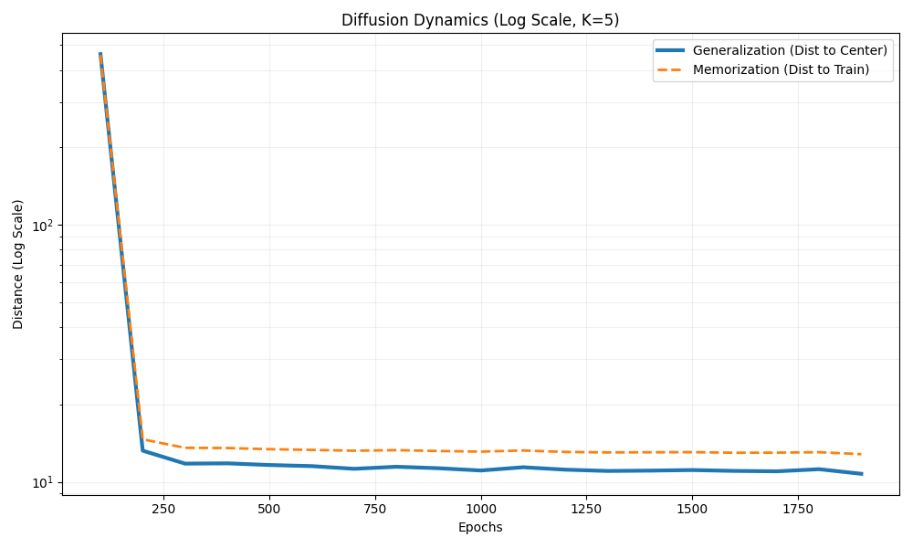

# Why Diffusion Models Don't Memorize: PyTorch Implementation

[](https://www.python.org/)
[](https://pytorch.org/)
[]()

> **Unofficial implementation** of experiments from the paper:  
> **"Why Diffusion Models Don't Memorize: The Role of Implicit Dynamical Regularization in Training"**  
> *NeurIPS 2025 Best Paper Award (Biroli et al.)*

## 🎯 Project Goal
This project reproduces the phase transition phenomenon in diffusion models. We demonstrate that during training, diffusion models first learn the **manifold structure (Generalization)** before overfitting to specific training examples (**Memorization**).

## 🔬 The Experiment
We train a simplified Diffusion Model (DDPM-like) on a High-Dimensional Gaussian Mixture Model ($D=128$, $N=5000$).

**Metrics tracked:**
1.  **Generalization Error:** Distance from generated samples to the true cluster centers.
2.  **Memorization Error:** Distance from generated samples to the nearest training example.

### Key Observation
According to the theory, there should be a **gap** between these two metrics.
- If $E_{gen} < E_{mem}$, the model is generating *new* valid data (Generalization).
- If $E_{gen} \approx E_{mem}$, the model has collapsed to the training set (Overfitting).

## 📊 Results

Below is the training dynamics on Apple Silicon (M4).



### 📉 Analysis of Results

By observing the final epoch metrics (Log Scale plot), we can confirm the hypothesis:

1.  **Generalization Error (Blue Line):** Converges to a lower value ($\approx 10^{1}$). This indicates the model successfully generates points near the true cluster center (the "Signal").
2.  **Memorization Error (Orange Line):** Remains consistently higher ($\approx 1.5 \times 10^{1}$).

**Conclusion:**
This gap proves that the diffusion model **did not memorize** the training data.
If the model had "memorized" (overfitted), the Orange line would have dropped to match or go below the Blue line (generating exact copies of training noise).
Instead, the model ignored the noise and learned the underlying **manifold structure**, demonstrating **Implicit Dynamical Regularization**.

### 🚀 How to Run

1. **Clone the repository and run:**
   ```bash
   git clone https://github.com/IvanVerkhovensky/diffusion-memorization.git
   cd diffusion-memorization
   pip install -r requirements.txt
   python train.py
   ```
   

   

   