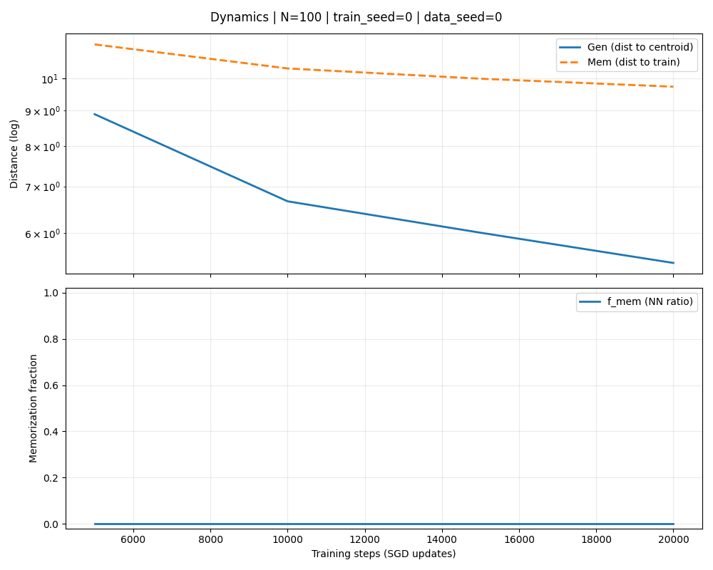
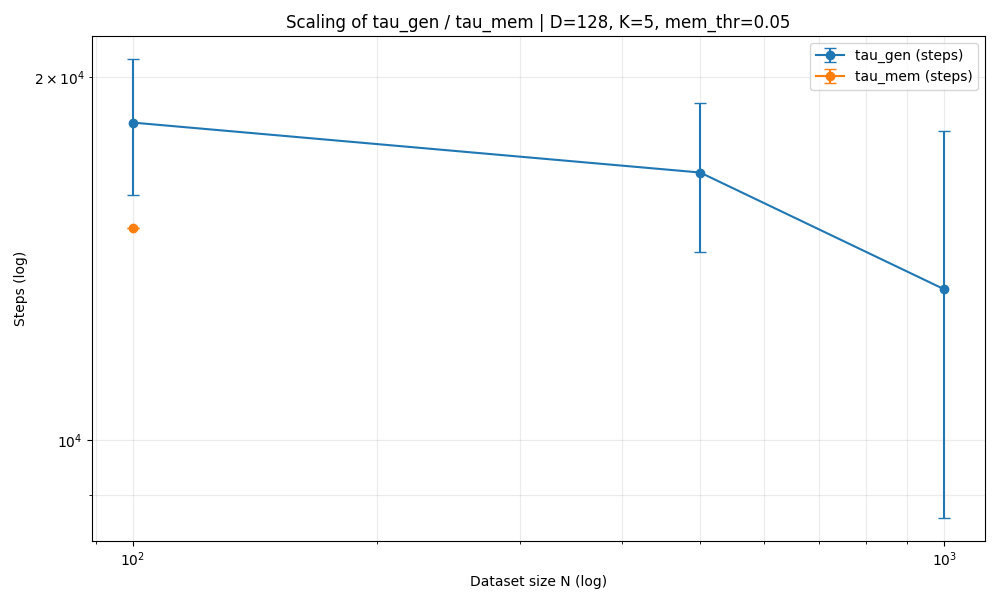
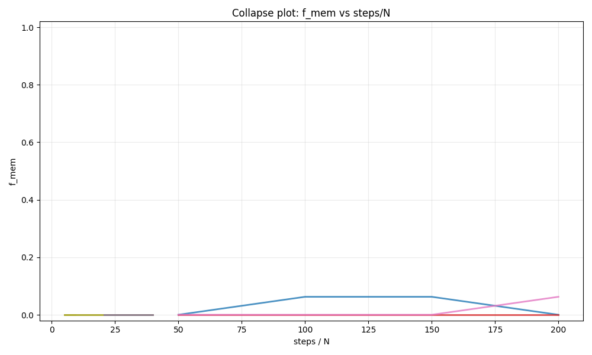
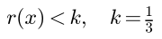

# Diffusion Memorization Dynamics — Replication (PyTorch, Apple Silicon / MPS)

I replicate core ideas from the NeurIPS 2025 paper  
**“Why Diffusion Models Don't Memorize: The Role of Implicit Dynamical Regularization”** on **synthetic high-dimensional Gaussian Mixture Models (GMM)**.

The goal of this repo is to make the **generalization vs memorization** behavior measurable, reproducible, and runnable on a Mac (PyTorch MPS).

---

## TL;DR

- I train a DDPM-like denoiser on a high-dimensional GMM and track **Generalization error** vs **Memorization error** over training time.
- I also implement a paper-aligned **memorization fraction** metric and extract two timescales: **τ_gen** and **τ_mem**.
- This repo includes a clean runner for single experiments and small scaling sweeps (compute-limited on MPS).

---

## Results (Mac compute-limited)

### Single-run dynamics (Gen/Mem + memorization fraction)


### Scaling of timescales (τ_gen / τ_mem)


### Collapse plot (f_mem vs τ/N)


Summary table: `artifacts/summary_mac_compute_limited.csv`

> Compute note: On Apple Silicon / MPS, reaching very late-time memorization for larger dataset sizes can require more training steps than practical locally.
> In those cases **τ_mem may be undefined within the current budget**, i.e. **τ_mem > τ_max** (right-censored).

---

## What I’m trying to show

Diffusion models can go through a **generalization-first regime** (learning the underlying structure) before a later-time **memorization regime** (generated samples become unusually close to specific training samples).
This repo makes that behavior easy to measure and compare across dataset sizes.

---

## What’s implemented

### Phase 1 — Synthetic dynamics: Generalization vs Memorization “gap”
I train a DDPM-like denoiser (MLP) on a high-dimensional GMM (default `D=128`) and track:

- **Generalization error**: distance from generated samples to the nearest true cluster centroid
- **Memorization error**: distance from generated samples to the nearest training example

A persistent separation between these curves corresponds to a “generalization-first” regime.

### Phase 2 — Paper-style protocol: two timescales + memorization fraction
To align the measurement protocol with the paper:

- I measure training time as **SGD steps (optimizer updates)**, not epochs.
- I log a **memorization fraction** based on a **1-NN vs 2-NN ratio** criterion.

#### Memorization fraction:

<p align="center"></p>
<p align="center"></p>
<p align="center"></p>

---

## Repo structure

- `src/data.py` — synthetic GMM data generator
- `src/model.py` — MLP denoiser
- `train.py` — training + sampling + metrics
- `scripts/render_equations.py` — renders equation SVGs for the README
- `figures/` — curated plots for README (committed)
- `artifacts/` — curated CSV summaries (committed)
- `results/` — raw run outputs (not committed)

---

## Setup

```bash
python -m venv .venv
source .venv/bin/activate
pip install -r requirements.txt
```
---
## How to run

### Single run 

Produces one run with:
- Gen/Mem dynamics (log-scale)
- `f_mem(step)` dynamics

```bash
python train.py --mode single \
  --n_train 100 \
  --train_seed 0 --data_seed 0 \
  --max_steps 20000 \
  --eval_every_steps 5000 \
  --n_eval_samples 16 \
  --train_chunk_size 1024 \
  --device auto
```
---

## Scaling sweep

```bash
python train.py --mode scaling \
  --n_list 100 500 1000 \
  --seeds 0 1 2 \
  --max_steps 20000 \
  --eval_every_steps 5000 \
  --n_eval_samples 16 \
  --train_chunk_size 1024 \
  --device auto
```